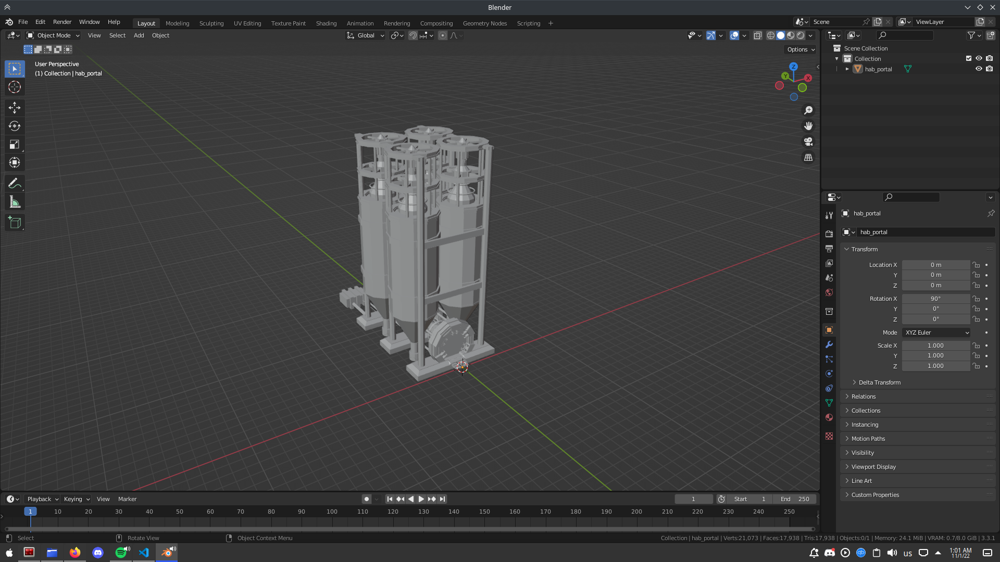
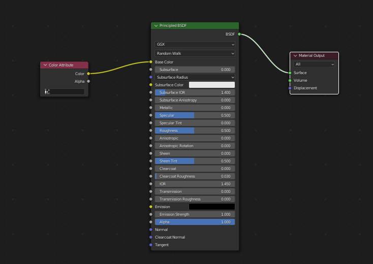
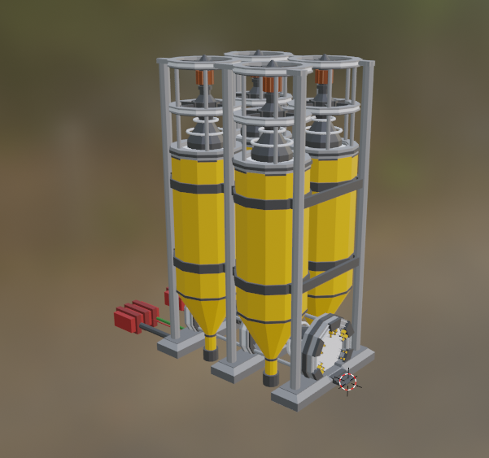

# Egg Inc. RPO Converter

Python script for converting Egg Inc. .rpo models to Wavefront OBJ.

## Usage
```sh
python rpo.py [--help, -h, --version, -v] <command> [args]
```
### Commands
- `single <example.rpo> [output.obj]`
    - converts a single file and outputs it to the specified path(or to example.obj if not specified)
- `multi [example.rpo ...]`
    - converts one or more files
- `dir <source-directory> <output-directory>`
    - converts all files in a directory and outputs them to the specified output directory

## Extracting Models
To extract models all you need is a recent version of Python 3, the script `rpo.py` and the APK of the game.

### Obtaining the APK
You can find the game's APK on the internet. After downloading it you can extract it with 7zip. If you download an XAPK file it can also be extracted and it will contain multiple APKs. You need the one named `com.auxbrain.egginc.apk`.

### Using the tool
After extracting your APK, you will need to go to `assets/rpos/` where all the models are stored. You can copy them to another directory or leave them there and use the tool from somewhere else.  

Now open cmd and run the following with your corresponding paths.  
`python rpo.py dir "path/to/your/rpo's/" "output/directory/"`  

Now if you've done everything right, you should get an output similar to this:  
```
[SUCCESS] Successfully converted ei_hatchery_pumpkin
[SUCCESS] Successfully converted warehouse
[WARNING] 'afx_box_1_glow.rpo' uses an unsupported format, it will not be converted
[SUCCESS] Successfully converted ei_vehicle_semi
[SUCCESS] Successfully converted ei_hoa_2_touch
[SUCCESS] Successfully converted ei_hatchery_edible
[SUCCESS] Successfully converted ei_coop_touch
[SUCCESS] Successfully converted double_decker
[SUCCESS] Successfully converted hab_monolith_boundary
[SUCCESS] Successfully converted ei_hyperloop_stop
[SUCCESS] Successfully converted ei_silo_2_med
```
The warnings are normal in the current version (`v1.0`) as a few files have different formats. I will update it soon so it supports those files aswell.

In your output directory you should have a bunch of .obj files.

### Using the models in Blender
The game uses vertex colors instead of textures so there is a little bit more work to do before using them.

First import your model into Blender:


Then go to the Shading tab, create a new material and set it up like this:


And finally, you should have a beautiful model:
